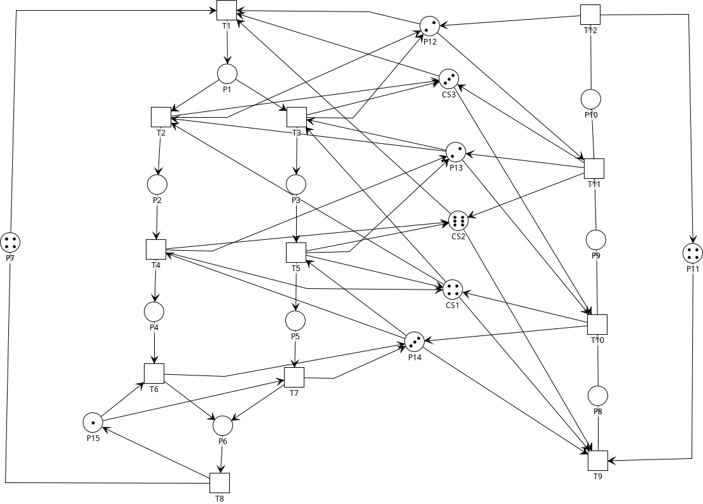

Programación Concurrente - 2022 - Trabajo Practico Final

# Picasso - Sistema de Procesamiento de Imágenes basado en Redes de Petri
Picasso es un sistema modular de procesamiento de imágenes basado en redes de Petri. Este sistema proporciona una plataforma flexible y escalable para la ejecución concurrente de tareas de procesamiento de imágenes. Utiliza una implementación de red de Petri para modelar y coordinar las interacciones entre diferentes componentes del sistema, permitiendo una gestión eficiente y ordenada de las transiciones.

> [!IMPORTANT]
> Este proyecto implementa una simulación de un sistema de procesamiento de imágenes basado en redes de Petri. No es un sistema de procesamiento de imágenes real.

## Autores

- **Robledo, Valentín**
- **Bottini, Franco Nicolas**
- **Lencina, Aquiles Benjamin**

## ¿Cómo clonar este repositorio?

```console
git clone https://github.com/FrancoNB/TP-Final-Concurrente-2022.git
```

## ¿Cómo utilizar?

Vamos al directorio principal del proyecto y utilizamos el siguiente comando

```console
./gradlew run
```

> [!NOTE]
> Se requier Java JDK 8 o superior.

> [!IMPORTANT]
> El programa está configurado para ejecutarse durante un tiempo predeterminado, definido por la constante `TIME_EXECUTION` en la clase `Main`. Por defecto, el tiempo de ejecución está establecido en 60000 milisegundos (60 segundos). Puede ajustar este valor según sus preferencias en el código fuente. Luego de este tiempo de ejecución, el programa finalizará automáticamente. El resustado de la ejecución se puede encontrar en el directorio `data/log`.

## Descripción del Sistema
El sistema se modela mediante una red de Petri, donde las plazas representan estados del sistema, recursos compartidos y buffers, mientras que las transiciones reflejan las actividades realizadas. La red se compone de elementos clave como P0, P1, P2, P3, P4, P5, P7, P8, P9 (plazas de actividades), P11, P12, P13, P14 (recursos compartidos) y P6, P10 (buffers inactivos). Finalemnte, las plazas CS1, CS2 y CS3 son plazas de control.

<p align="center">
  
</p>

### Funcionamiento
La generación de imágenes implica la aplicación secuencial de diversos patrones sobre un lienzo en "blanco", representado mediante mapas de bits de distintos tamaños. Estos patrones, generados a partir de semillas aleatorias, se dividen en tres tipos: Templates, que definen la forma base; Filtros, que alteran la imagen base; y Coloreadores, que añaden color a la imagen. Además, se emplean métodos de aplicación como "Blanco y negro", "A color", "Difusión" y "Superposición". La imagen final se comprime en formato JPG.

#### 2.2 Plazas

##### 2.2.1 Plazas Inactivas ("Buffers")

- **P7:** Representa los lienzos en espera de patrones para la creación de nuevas imágenes.
- **P11:** Indica las semillas esperando para modificar los patrones aplicables.

##### 2.2.2 Plazas de Actividad (Estados del Sistema)

- **P1:** Aplicación de un templete a un lienzo.
- **P2:** Filtrado de "Difusión" al lienzo.
- **P3:** Filtrado de "Superposición" al lienzo.
- **P4:** Pintura "a color" del lienzo.
- **P5:** Pintura "blanco y negro" del lienzo.
- **P6:** Compresión del lienzo en formato JPG.
- **P8:** Cambio del patrón de un coloreador.
- **P9:** Cambio del patrón de un filtro.
- **P10:** Cambio del patrón de un templete.

##### 2.2.3 Plazas de Recursos Compartidos

- **P12:** Templates a la espera de ser utilizados o modificados por semillas.
- **P13:** Filtros a la espera de aplicación o modificación por semillas.
- **P14:** Coloreadores a la espera de aplicación o modificación por semillas.
- **P15:** Compresores responsables de dar formato JPG a las imágenes.

#### 2.3 Transiciones

##### 2.3.1 Transiciones Instantáneas

- **T1:** Espera a un lienzo y un templete para sensibilizarse.
- **T2:** Espera a un filtro y la finalización de la aplicación del templete para sensibilizarse, devolviendo un templete.
- **T3:** Espera a un filtro y la finalización de la aplicación del templete para sensibilizarse, devolviendo un templete.
- **T9:** Espera a un coloreador y un comportamiento para sensibilizarse.

##### 2.3.2 Transiciones Temporales

- **T4:** Espera a un coloreador y la finalización de la aplicación del filtro para sensibilizarse, devolviendo un filtro.
- **T5:** Espera a un coloreador y la finalización de la aplicación del filtro para sensibilizarse, devolviendo un filtro.
- **T6:** Espera a un compresor y la finalización de la aplicación del coloreador para sensibilizarse, devolviendo un coloreador.
- **T7:** Espera a un compresor y la finalización de la aplicación del coloreador para sensibilizarse, devolviendo un coloreador.
- **T8:** Debe haberse terminado la compresión del lienzo para sensibilizarse y devolverlo al buffer de lienzos.
- **T10:** Espera a un filtro y la finalización de la modificación del coloreador para sensibilizarse, devolviendo un coloreador.
- **T11:** Espera a un templete y la finalización de la modificación del filtro para sensibilizarse, devolviendo un filtro.
- **T12:** Debe haberse terminado la modificación del templete para sensibilizarse, devolviendo un templete y un comportamiento.

Este modelo proporciona una representación estructurada y detallada del sistema de generación de imágenes abstractas basado en la red de Petri implementada. Cada elemento de la red y su función en el contexto del sistema están claramente definidos, ofreciendo una comprensión más profunda de la semántica y la estructura del proyecto.

## Implementación

El proyecto está organizado en paquetes que encapsulan diferentes aspectos del sistema:

### Paquete `com.picasso.Policy`

Este paquete contiene clases relacionadas con la implementación de políticas de ejecución de transiciones.

- `Policy`: Interfaz que define el contrato para implementar políticas de transición.
  
- `PolicyMinTransitions`: Implementa una política que elige la transición con menos transiciones ejecutadas y menos invariantes ejecutados.

- `PolicyRandom`: Implementa una política que elige una transición de manera aleatoria.

### Paquete `com.picasso.Artist`

Contiene clases que representan "artistas", componentes que realizan acciones específicas durante la ejecución de las transiciones.

- `Artist`: Interfaz que define el contrato para implementar artistas asociados a transiciones.

- `Diffuser`: Clase que implementa un artista para la transición de difusión.

- `RGBPainter`: Clase que implementa un artista para la transición de pintura RGB.

- `SuperPositioner`: Clase que implementa un artista para la transición de superposición.

- `BWPainter`: Clase que implementa un artista para la transición de pintura blanco y negro.

- `Compressor`: Clase que implementa un artista para la transición de compresión.

- `PainterPattern`: Clase que implementa un artista para la transición de patrón de pintura.

- `FilterPattern`: Clase que implementa un artista para la transición de patrón de filtro.

- `TemplatePattern`: Clase que implementa un artista para la transición de patrón de plantilla.

#### Tareas y Tiempos de Ejecución
La siguiente tabla detalla las tareas ejecutadas por los artistas durante la simulación, junto con los tiempos simulados para cada tarea.

| Transición | Artista         | Tiempo de Ejecución promedio (ms) |
|------------|-----------------|-----------------------------------|
| T7         | BWPainter       | 36.5                              |
| T6         | RGBPainter      | 43.5                              |
| T8         | Compressor      | 65.5                              |
| T4         | Diffuser        | 22.5                              |
| T5         | SuperPositioner | 25.0                              |
| T10        | PainterPattern  | 14.0                              |
| T11        | FilterPattern   | 17.5                              |
| T12        | TemplatePattern | 21.5                              |

### Paquete `com.picasso.Monitor`

Contiene la clase que gestiona la ejecución y el monitoreo de la red de Petri, manteniendo registros detallados de las transiciones y los invariantes ejecutados.

- `Monitor`: Clase que monitorea la ejecución de la red de Petri y registra estadísticas detalladas.

### Paquete `com.picasso.PetriNet`

Este paquete contiene clases relacionadas con la implementación y gestión de la red de Petri.

- `PetrinetElement`: Representa un elemento básico de la red de Petri, que puede ser un lugar (`Place`), una transición (`Transition`), o cualquier otro componente. Proporciona una interfaz común para elementos específicos.

- `PetriNet`: La clase principal que define la estructura y comportamiento de la red de Petri. Incluye métodos para la ejecución de transiciones, configuración de tiempos de transición y manejo de marcados y matrices de incidencia.

- `Place`: Clase que representa un lugar en la red de Petri. Contiene información sobre el nombre del lugar, el marcado actual y proporciona métodos para modificar el marcado.

- `Transition`: Clase que representa una transición en la red de Petri. Almacena información sobre el nombre de la transición, los lugares de entrada y salida, y maneja la ejecución de la transición.

- `Arc`: Modela un arco en la red de Petri, conectando un lugar a una transición o viceversa. Almacena información sobre la dirección del arco y su peso.

Estas clases forman la columna vertebral de la implementación de la red de Petri en el sistema. La clase `PetriNet` sirve como el punto central para interactuar con la red, mientras que `Place`, `Transition`, y `Arc` encapsulan los detalles específicos de lugares, transiciones y arcos respectivamente.

### Paquete `com.picasso.Data`
Contiene clases relacionadas con la gestión de datos y registros.

- `Logger`: Clase que se encarga de registrar eventos y estadísticas de la ejecución del sistema.

### Paquete `com.picasso.Segment`

Este paquete contiene la clase que representa un segmento de la red de Petri.

- `Segment`: Clase que modela un conjunto de transiciones que se ejecutan juntas. Proporciona una forma de organizar y coordinar las ejecuciones simultáneas.

### Clase Principal `Main`

- `Main`: Clase principal que orquesta la configuración y ejecución del sistema. Define la red de Petri, las políticas de ejecución y los segmentos de procesamiento.

### Diagrama de Clases

<p align="center">
  
</p>

## Logs

En el desarrollo de este proyecto, se ha implementado un sistema de registros de log para facilitar la comprensión y el seguimiento de las actividades realizadas por el sistema. Los registros de log son esenciales para la depuración, el monitoreo y la evaluación del rendimiento del sistema. A continuación, se detallan los tipos de logs utilizados y su significado:

### 3.1 Tipos de Logs

- **Artistas:** Los logs de artistas registran las acciones y eventos realizados por artistas específicos durante la ejecución del sistema. Estos registros son útiles para realizar un seguimiento preciso de cómo cada tipo de artista contribuye a la transformación de la imagen. Se coloca el tiempo en el que se dio cada suceso como prefijo del log.

- **Transiciones:** Los logs de transiciones registran el disparo de una transición particular junto con el hilo de ejecución asociado. Esto es útil para rastrear el flujo de ejecución y verificar la correcta activación de las transiciones en el sistema.

- **Sistema:** Los logs del sistema informan sobre la finalización de un hilo de ejecución específico. Esto es útil para comprender cuándo se completan las actividades y cómo se manejan los diferentes segmentos del sistema.

- **Estadísticas:** Los logs de estadísticas brindan una visión general del rendimiento del sistema, incluido el tiempo total de ejecución, la cantidad de transiciones ejecutadas y la cantidad de invariantes activados. Estos registros son cruciales para evaluar la eficiencia y la efectividad del sistema.

### Ejemplos de Logs

A continuación, se presentan ejemplos de logs generados por el sistema:

#### Log de Artistas

```
[122] WORK END -> Diffuser                           
[164] WORK END -> RGB Painter                        
[182] WORK END -> Diffuser                           
[199] WORK END -> Refactory Painter Pattern          
[200] WORK END -> Diffuser                           
[213] WORK END -> Refactory Painter Pattern          
[218] WORK END -> Refactory Filter Pattern           
[220] WORK END -> Compressor                         
[221] WORK END -> RGB Painter                        
[235] WORK END -> Refactory Filter Pattern           
[239] WORK END -> Refactory Template Pattern         
[254] WORK END -> Refactory Template Pattern    
```

> [!NOTE]
> El prefijo entre corchetes indica el tiempo en milisegundos (`[TIME]`) que transcurrió desde el inicio de la ejecución del sistema hasta la impresión del registro.

#### Log de Transiciones

```
FIRED     -> T4 ON [Segment A - Thread 1]
FIRED     -> T8 ON [Segment D - Thread 0]
COOL-DOWN -> T4 (0[ms] < 3[ms])
TIME-OUT  -> T4 (5[ms] > 3[ms])
```

#### Log del Sistema

```
STARTED  -> [Segment E - Thread 3]
FINISHED -> [Segment E - Thread 3]
```

#### Log de Estadísticas

```
* ------------------------------ STATISTICS ------------------------------ *

- TIME EXECUTION -> 60000ms

- TRANSITIONS FIRED
	T1  -> 919
	T2  -> 459
	T3  -> 459
	T4  -> 459
	T5  -> 458
	T6  -> 458
	T7  -> 458
	T8  -> 915
	T9  -> 461
	T10 -> 459
	T11 -> 458
	T12 -> 458

- INVARIANTS FIRED
	INV [9, 10, 11, 12] -> 458
	INV [1, 3, 5, 7, 8] -> 458
	INV [1, 2, 4, 6, 8] -> 458

* ------------------------------ STATISTICS ------------------------------ *
```

Estos ejemplos proporcionan una visión práctica de cómo interpretar los registros de log y cómo los diferentes tipos de logs contribuyen a la comprensión y el monitoreo efectivos del sistema.

---

Este README proporciona una visión resumida del sistema, si desea obtener más información, consulte el informe detallado en el archivo [`Informe.pdf`]().